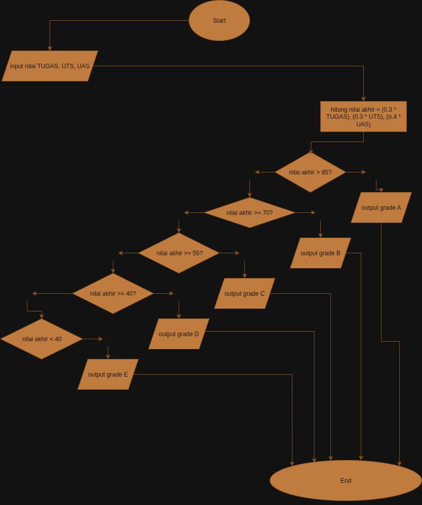

Algoritma Menghitung Nilai Akhir dan Grade

1. Mulai

2. Masukkan nilai tugas

3. Masukkan nilai UTS

4. Masukkan nilai UAS

5. Hitung Nilai Akhir dengan rumus:

nilai akhir = (0.3 * tugas) + (0.3 * UTS) + (0.4 * UAS)

6. Tentukan Grade berdasarkan Nilai Akhir:

- Jika Nilai Akhir ≥ 85 → Grade = A

- Jika Nilai Akhir ≥ 70 → Grade = B

- Jika Nilai Akhir ≥ 55 → Grade = C

- Jika Nilai Akhir ≥ 40 → Grade = D

- Selain itu → Grade = E

7. Tampilkan Nilai Akhir

8. Tampilkan Grade

9. Selesai -->


```tugas no 1
 
// Program Menghitung Nilai Akhir dan Grade

// Input nilai (PSEUDOCODE)
let tugas = 80;
let uts = 75;
let uas = 90;

// Hitung nilai akhir
let nilaiAkhir = (0.3 * tugas) + (0.3 * uts) + (0.4 * uas);

// Tentukan grade
let grade;
if (nilaiAkhir >= 85) {
    grade = "A";
} else if (nilaiAkhir >= 70) {
    grade = "B";
} else if (nilaiAkhir >= 55) {
    grade = "C";
} else if (nilaiAkhir >= 40) {
    grade = "D";
} else {
    grade = "E";
}

// Output hasil
console.log("nilai tugas:", tugas);
console.log("nilai tugas", uts);
console.log("nilai tuhgas", uas);
console.log("Nilai Akhir:", nilaiAkhir);
console.log("Grade:", grade);
```


//TUGAS NO 2
//Draw.io 


